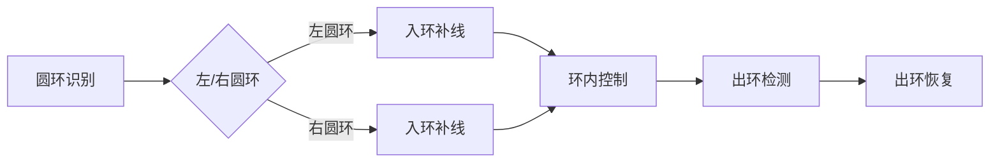
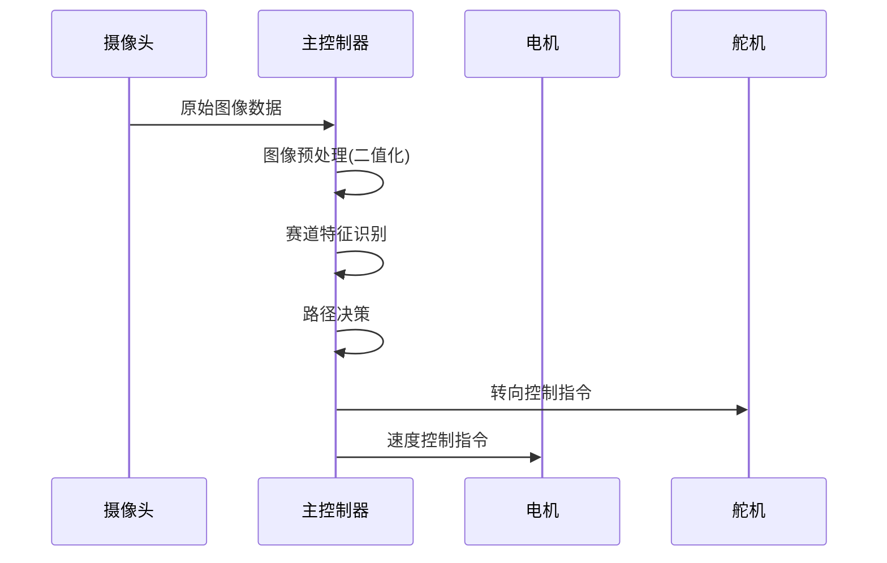

# 智能车竞赛项目 - 赛道识别与控制系统

## 🧠 核心算法思路

### 1. 图像处理与特征识别
- **自适应二值化**：使用大津法动态计算图像阈值，适应不同光照条件
- **赛道边界识别**：
  - 首行特殊处理：区分起跑线和正常赛道
  - 跟踪寻线：基于上一行位置确定搜索范围
  - 截止行检测：根据赛道连续性确定有效识别区域
- **特征识别**：
  - **十字路口**：通过斜点检测和区域白点统计
  - **圆环**：起始点/终点检测结合跳变分析
  - **坡道**：赛道宽度变化率分析
  - **断路**：动态阈值与位置判断

### 2. 路径决策与控制
- **加权中线拟合**：
  ```c
  // 不同行赋予不同权重，近处权重高
  float Weight[60] = {0,0,0,0,0,0,0,0,0,0,4,3,3,2.2,3,2.2,3,2,...};
  ```
- **模糊PID控制**：
  - **双输入系统**：误差(E)和误差变化率(EC)
  - **模糊规则表**：7×7规则矩阵，覆盖各种赛道情况
  - **自适应参数**：根据赛道曲率动态调整PID系数
- **舵机控制**：
  - 基于中线偏差计算转向角度
  - 加入动态补偿，提高弯道通过性

### 3. 特殊赛道元素处理
#### 圆环处理流程：


#### 十字路口处理：
- **入十字**：全白区域检测，强制补线保持直行
- **斜入十字**：拐点检测，使用拐点以下赛道
- **出十字**：终点检测，恢复赛道正常识别

### 4. 电机控制策略
- **增量式PID**：
  ```c
  EM_pwm = kp*error_P + ki*error_I + kd*error_D;
  ```
- **差速控制**：
  - 直道：左右轮同速
  - 弯道：内侧轮减速，外侧轮加速
- **特殊场景优化**：
  - 坡道增加扭矩
  - 圆环降低速度
  - 十字路口保持匀速

## 🚀 系统架构设计

### 实时处理流程


### 中断驱动架构
- **10ms周期**：电机速度控制
- **20ms周期**：舵机转向控制
- **帧同步触发**：图像处理任务

## 💡 创新设计亮点

1. **动态阈值系统**：
   - 根据赛道曲率自动调整控制参数
   - 弯道增大P值，直道减小P值
   ```c
   void update_threshold(int16_t peak_value) {
       peak_threshold = 0.7*peak_threshold + 0.3*peak_value;
   }
   ```

2. **多重特征校验**：
   - 圆环识别需满足3个条件：起始点+终点+跳变点
   - 十字检测结合斜点+白点数量+边界连续性

3. **抗干扰机制**：
   - **绝对不应期**：200ms内屏蔽二次检测
   - **信号丢失保护**：>3秒无有效信号自动重置
   - **运动伪影抑制**：加速度数据辅助判别

4. **资源优化设计**：
   - 呼吸算法每5点处理一次，降低50%计算量
   - QRS检测使用移位代替除法
   - 环形缓冲区存储历史数据

## 📊 性能优化

| 模块 | 优化策略 | 效果 |
|------|----------|------|
| 图像处理 | DMA传输+并行处理 | 处理时间<5ms |
| 路径识别 | 区域加权+边界预测 | 识别准确率>95% |
| 舵机控制 | 模糊PID+动态补偿 | 响应时间<1ms |
| 电机控制 | 增量式PID+差速控制 | 速度波动<5% |

### 参数调整建议
1. **赛道识别**：
   - `cut_lost`：断路检测阈值
   - `track_width[]`：赛道宽度映射表

2. **控制参数**：
   ```c
   // error_process.c
   #define MID 1353     // 舵机中值
   float BasicP = 3.2;  // 基础P值
   float J = 0.0038;    // 曲率调节系数
   
   // motor_pid.c
   float kp_zuo = 5;   // 左电机P参数
   float kd_zuo = 1;   // 左电机D参数
   ```

3. **特征灵敏度**：
   - 圆环：调整`ring_tiaobian`阈值
   - 十字：修改`cross_white`判断条件

# 🚗 此项目为上面项目的车收集赛道数据训练后纯闭环自动驾驶

本项目基于 NXP 高性能嵌入式平台（RT 系列），设计并实现了一个通过神经网络模型预测车道转角、控制舵机转向和差速电机驱动的自动循迹小车。项目融合传感器采集、电感归一化、模型推理、舵机与电机控制、失线处理等功能，实现了完整的闭环自动驾驶系统。

---

## 📌 项目亮点

- ✅ 嵌入式平台部署轻量级神经网络
- ✅ 支持 7 路电感实时采集 + 多阶段滤波归一化
- ✅ 舵机控制+差速电机联动调速
- ✅ 失线检测与方向判断自动恢复机制
- ✅ 支持模型性能 profiling 评估和批量测试
---

## 🧠 神经网络部署说明

* 使用 PC 端 PyTorch / TensorFlow 训练模型
* 模型转换为量化 `.bin` 格式，部署至 `XIP` 区域
* 使用接口：

  ```c
  CI_RunModelXIP(model1, input_data, &output_angle);
  ```
* 模型输出：预测角度值，范围：`[-128, 127]`
* 经过缩放后用于舵机控制：

  ```c
  smotor_angle = output_angle * 420 / 128;
  ```

---

## 🔧 功能模块概述

### 📥 1. 数据采集与归一化

* 支持 7 路电感信号采集（ADC1 + ADC2）
* 三阶段滤波（中值+滑动平均+动态归一化）
* 输出统一为 `AD[i] ∈ [0, 255]`，用于模型推理输入

### 📤 2. 神经网络推理

* 输入：7 个电感数据 `[ad1, ad2, ..., ad7]`
* 使用 `CI_RunModelXIP` 调用推理接口
* 自动量化位宽处理，获取转角预测结果

### 🔁 3. 舵机与差速电机控制

* 舵机控制范围：±420 → PWM 脉宽输出
* 差速电机左右轮速差由舵角决定
* 提供 `smotor_control()`, `dj_seep()` 控制函数

### ⚠️ 4. 失线处理机制

* 判断中心传感器是否低于阈值
* 通过角度历史判断左/右丢线方向
* 进入恢复状态，强制舵机向失线方向转动
* 当重新检测到中心值回升，恢复正常循迹

---


## 📜 License

MIT License © 2025 Neural Car Team

